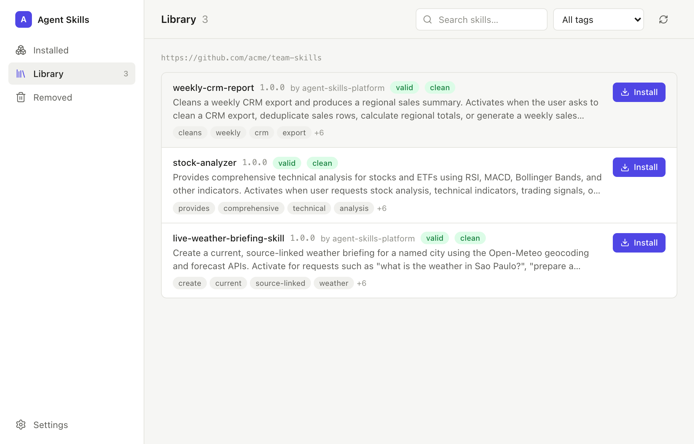
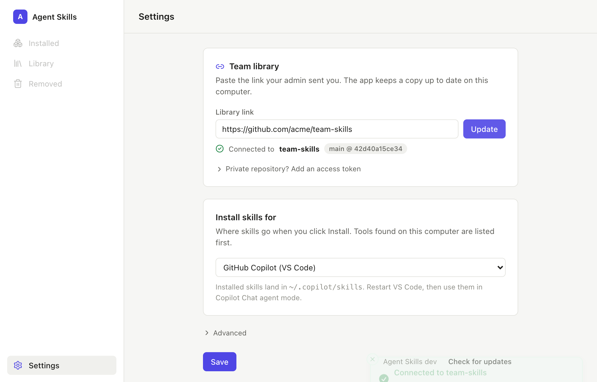
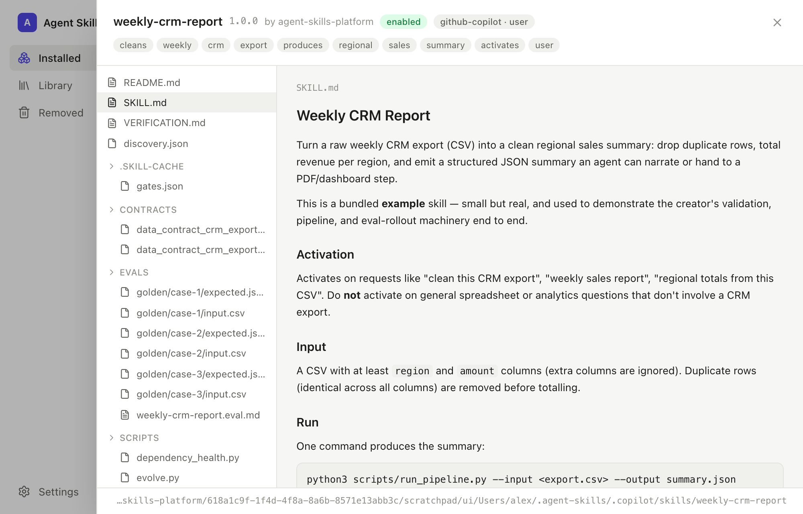

# Desktop app

A desktop app for teammates who want to browse the team's skills, read what a
skill does, and install it into GitHub Copilot (or another AI tool) — without a
terminal, Python, or Git.



## For teammates

**Get it.** Download the installer for your computer from the
[latest desktop release](https://github.com/FrancyJGLisboa/agent-skills-platform/releases?q=desktop&expanded=true)
and open it.

- macOS: the `.dmg` for Apple Silicon or Intel. If macOS says the app is from
  an unidentified developer, right-click the app → Open (once).
- Windows: the `.msi` or `-setup.exe`.
- Linux: the `.AppImage` or `.deb`.

**Connect the library.** The app opens on Settings. Paste the library link your
admin sent you and click **Connect**. If the repository is private, open
"Private repository? Add an access token" and paste a personal access token
with read access — it goes into your system keychain, not the app.



**Pick where skills go.** "Install skills for" defaults to GitHub Copilot
(VS Code); tools found on your computer are listed first. Click **Save**.

**Install.** Open **Library**, click a skill to read its `SKILL.md` and browse
its files, then click **Install**. Restart VS Code and the skill is available
in Copilot Chat agent mode.



**Keep it tidy.** **Installed** lists what you have; the switch on each row
turns a skill off without removing it, and **Update** appears when the library
has a newer version. **Removed** keeps anything you uninstall for 30 days.

The app refreshes the library and checks for its own updates each time it
opens. Nothing leaves your computer except the library download.

## For library admins

A team library is a Git repository containing a skill registry. Creating one
takes four commands and a push; teammates never see any of this.

```bash
# 1. Create the registry
python3 scripts/skill_registry.py init --registry ~/team-skills --name "ACME Skills"

# 2. Publish each verified skill into it
python3 scripts/skill_registry.py publish ./weekly-crm-report --registry ~/team-skills --tags finance,reports

# 3. Put it on GitHub or GitLab (private is fine)
cd ~/team-skills && git init -b main && git add -A && git commit -m "Team library"
gh repo create acme/team-skills --private --source . --push

# 4. Share the link
echo "https://github.com/acme/team-skills"
```

`publish` runs validation and a security scan; skills that fail do not enter
the library. To ship an update, publish the new version and push — every
teammate's app picks it up on next launch and shows **Update** on the Installed
tab.

Private repositories: teammates need a personal access token with read access
to the repository (GitHub: a fine-grained token scoped to that repo with
*Contents: read*). SSH URLs work too when an SSH agent is running.

For departments, approvals, pinned releases, and rollback, use the
[governed team marketplace](TEAM_MARKETPLACE.md); the desktop app reads the
flat registry today and marketplace support is planned.

## For contributors

The app is a thin Tauri front end over `scripts/skill_registry.py`, which it
ships as a bundled binary; no registry logic lives in the app. Build, run, and
release instructions are in [`desktop/README.md`](../desktop/README.md).
